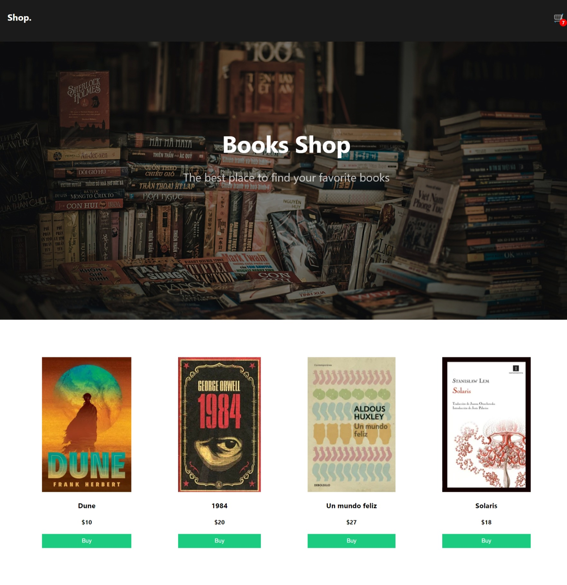
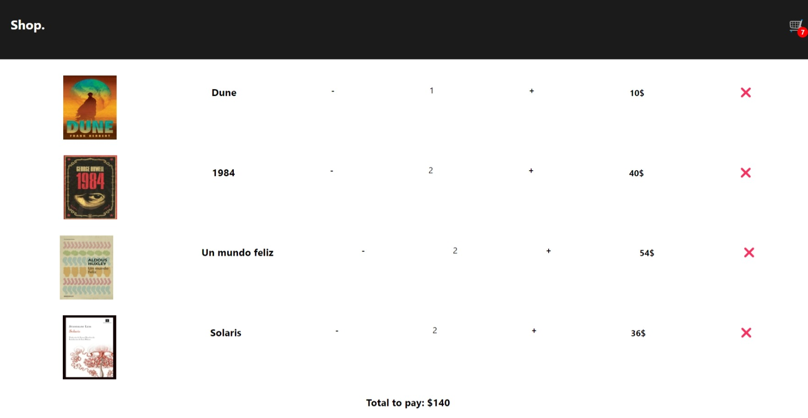

# Shopping Cart
This design was influenced by the work of [on the code](https://www.youtube.com/@onthecode). Please refer to the following videos as the basis for the design: [Part 1](https://youtu.be/uPYfPcMtOvI?si=3sQCPsRKSGnmvSUy), [Part 2](https://youtu.be/nApZnzqB0u8?si=XxyEhOjm1xldu-en).

## Technologies
This web page was made with the following technologies:
- HTML5
- CSS3
- JavaScript
- React
- React Router DOM
- Axios

## Pages
This web page contains 2 sections: **Home** and **Cart**.

### Home
#### In this section, you'll find the homepage which features a banner. Below the banner, there's a selection of books available for purchase. When you click on the 'Buy' button, the book is automatically added to the shopping cart located at the top right corner of the page.

### Cart
#### This is the shopping cart section, which displays a list of books that have been previously selected for purchase. For each book, you can increase the quantity to buy, view its price, and there's also an option to remove the book. Additionally, it shows the total amount to be paid.

